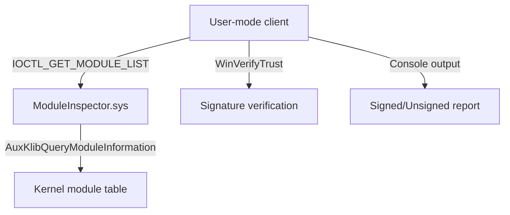

# Windows Kernel Driver Detection Lab

A portfolio-ready lab that bridges kernel mode and user mode to enumerate loaded drivers and flag unsigned binaries. **Always run inside an isolated virtual machine with snapshots.**

## Table of Contents
- [Features](#features)
- [Architecture](#architecture)
- [Repository Layout](#repository-layout)
- [Prerequisites](#prerequisites)
- [Build Instructions](#build-instructions)
- [Development Environment](#development-environment)
- [Deployment](#deployment)
- [Testing](#testing)
- [Debugging](#debugging)
- [Safety](#safety)
- [Contributing](#contributing)
- [License](#license)

## Features
- KMDF-friendly kernel driver that queries loaded modules via `AuxKlibQueryModuleInformation` and exposes results with a buffered IOCTL.
- Modern C++ console client that resizes IOCTL buffers as needed and validates driver signatures with `WinVerifyTrust`.
- Color-coded console output that highlights unsigned drivers as potential tampering/rootkit indicators.
- CI-backed ABI guard rails to keep shared payload layouts stable.
- CMake options to build the Windows client, optionally build the kernel driver (when the WDK is present), and run portable layout tests on any host.

## Architecture


See `docs/ARCHITECTURE.md` for the narrative description and `docs/API.md` for the IOCTL contract.

## Repository Layout
```
├─ include/              # Shared IOCTL definitions and payloads
├─ src/driver/           # KMDF driver implementation
├─ src/client/           # User-mode console client
├─ tests/                # Portable ABI/layout checks (ctest)
├─ docs/                 # Architecture, API, and testing docs
└─ .github/workflows/    # CI for portable tests
```

## Prerequisites
- Windows 10/11 x64 in a **virtual machine** with snapshot capability.
- Visual Studio 2022.
- Windows Driver Kit (WDK) matching the guest OS version (required for driver build/signing).
- Administrator privileges to load drivers and enable test signing.

## Build Instructions
### Portable ABI Tests (Linux/macOS/Windows)
```bash
cmake -S . -B build -DENABLE_HOST_TESTS=ON
cmake --build build
ctest --test-dir build --output-on-failure
```

### Windows Client (CMake)
```powershell
cmake -S . -B build -DENABLE_CLIENT=ON -DENABLE_HOST_TESTS=OFF
cmake --build build --config Release
# Output: build/ModuleInspectorClient.exe
```

### Windows Driver (CMake with WDK)
Enable the driver target only when the WDK include/lib paths are present (set in your Developer Command Prompt):
```powershell
set WDK_INCLUDE_PATH=C:\\Program Files (x86)\\Windows Kits\\10\\Include\\<version>\\km
set WDK_LIB_PATH=C:\\Program Files (x86)\\Windows Kits\\10\\Lib\\<version>\\km\\x64
cmake -S . -B build -DENABLE_DRIVER=ON -DENABLE_CLIENT=ON -DENABLE_HOST_TESTS=OFF
cmake --build build --config Release
# Outputs: build/driver/ModuleInspector.sys and ModuleInspectorClient.exe
```
> The CMake driver target uses `/DRIVER /SUBSYSTEM:NATIVE` flags. Sign the resulting `.sys` before loading.

## Development Environment
- **Dev Container (VS Code):** Open the repo in VS Code and rebuild inside the provided `.devcontainer` to get a CMake/clang-f
ormat-ready toolchain with Ninja. The container runs `cmake -S . -B build -DENABLE_HOST_TESTS=ON` after creation.
- **Formatting:** Run `clang-format -i $(git ls-files "*.c" "*.cpp" "*.h")` before committing. CI enforces formatting.
- **Further guidance:** See `docs/DEVELOPMENT.md` for contributor checklists and platform-specific notes.

### Manual (cl/link) Compilation
For reference, the legacy manual commands remain below:
```bat
cl /nologo /W4 /WX /DUNICODE /D_UNICODE /DWIN32 /D_WIN32_WINNT=0x0A00 /I"%WDK_INCLUDE_PATH%" /Iinclude /Fo:build/driver/ /Fd:build/driver/ /c src/driver/Driver.c
link /nologo /OUT:build/driver/ModuleInspector.sys /SUBSYSTEM:NATIVE /NODEFAULTLIB /DRIVER /ENTRY:DriverEntry build/driver/Driver.obj /LIBPATH:"%WDK_LIB_PATH%" aux_klib.lib ntoskrnl.lib
cl /nologo /W4 /WX /DUNICODE /D_UNICODE /EHsc /std:c++17 /Iinclude /Fe:build/client/ModuleInspector.exe src/client/Client.cpp
```
> Ensure the WDK environment variables (e.g., `WDK_INCLUDE_PATH` and `WDK_LIB_PATH`) point to your installed kit. Consider wrapping these commands in a `.vcxproj` for production use.

## Deployment
1. **Enable test signing (lab use only):**
   ```bat
   bcdedit /set testsigning on
   shutdown /r /t 0
   ```
2. **Install the driver service:**
   ```bat
   sc create ModuleInspector type= kernel binPath= C:\\Path\\To\\ModuleInspector.sys start= demand
   sc start ModuleInspector
   ```
3. **Run the client:**
   ```bat
   ModuleInspectorClient.exe
   ```
4. **Remove after testing:**
   ```bat
   sc stop ModuleInspector
   sc delete ModuleInspector
   bcdedit /set testsigning off
   shutdown /r /t 0
   ```

## Testing
- **Portable layout tests:** run via CTest as shown above; enforced in CI.
- **Integration tests:** manual in a Windows VM. Use both signed and unsigned drivers to confirm signature reporting.

## Debugging
- Attach WinDbg over a named pipe or network and set a breakpoint:
  ```
  bu ModuleInspector!DriverEntry
  g
  ```
- Use `!dbgprint` and `!analyze -v` after a crash to inspect IRPs and driver unload behavior.
- Keep a host snapshot to recover from misconfiguration.

## Safety
- Buffered I/O reduces the chance of dereferencing user pointers in kernel mode.
- Size checks and explicit buffer zeroing minimize BSOD risk.
- **Never** run on production machines; always test inside a disposable VM with snapshots.

## Contributing
See `CONTRIBUTING.md` and `CODE_OF_CONDUCT.md` for expectations. Security issues should be reported privately as described in `SECURITY.md`.

## License
Distributed under the MIT License. See `LICENSE` for details.
